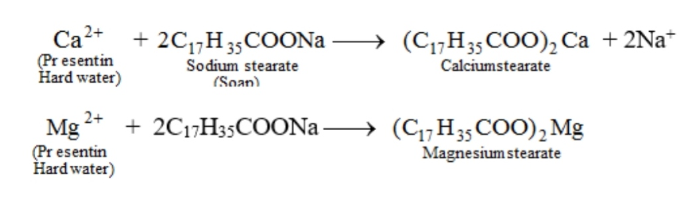
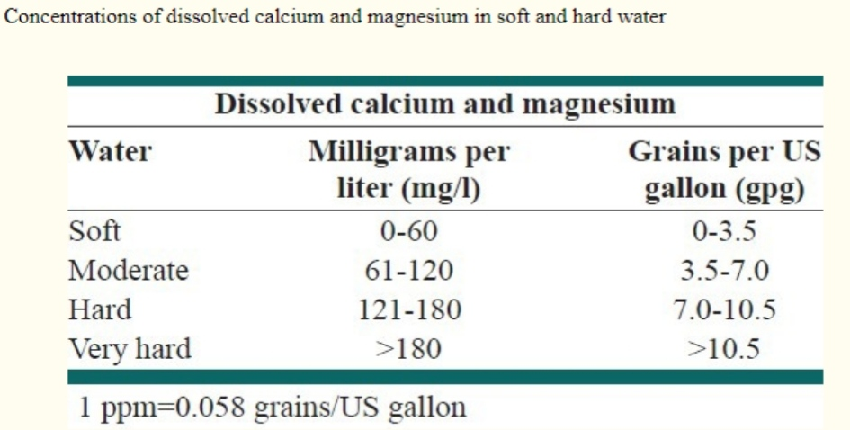
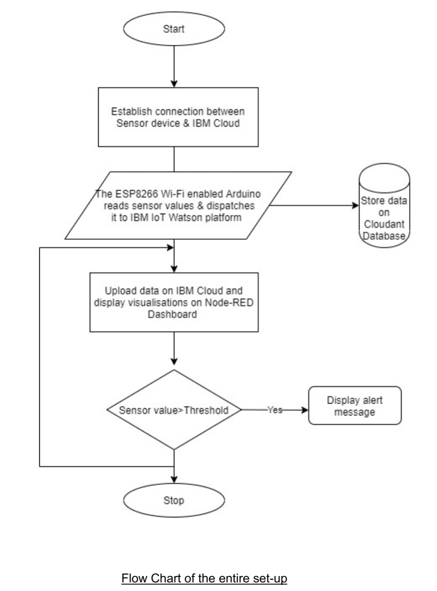

# IoT based Water Quality Analysis
R. Darsini,
PES University,
Bangalore, Karnataka.					

Neomi Sony,
CUSAT,
Kochi, Kerala.

## PROBLEM STATEMENT
Every organism on earth needs water to survive. Verbally saying whether water is good or bad isn't very simple but with water quality tests it can be measured and studied. Water quality is used to measure the condition of water through its physical, biological and chemical characteristics. The testing is done in the context of the intended use of the water. It is not a secret that the current problem of water pollution is a serious threat to the health of humanity. The reason is quite obvious since nowadays it is practically impossible to consume water without any artificial treatment being applied. What is meant here is the fact that nowadays water cannot be used in its original form as it is taken from nature. In stark contrast, water needs to undergo various stages of special treatment that prepares it for consumption by people without any harm to their health.

Water hardness is the traditional measure of the capacity of water to react with soap, hard water requiring considerably more soap to produce a lather. Hard water often produces a noticeable deposit of precipitate (e.g. insoluble metals, soaps or salts) in containers. It is not caused by a single substance but by a variety of dissolved polyvalent metallic ions, predominantly calcium and magnesium cations, although other cations (e.g. aluminum, barium, iron, manganese, strontium and zinc) also contribute. Hardness is most commonly expressed as milligrams of calcium carbonate equivalent per liter. 

The stearates formed in the above equations reduce the capacity of water to react with soap. environmental factor, which appears to be influencing mortality, in particular.

DISADVANTAGES OF HARD-WATER

In the past five decades or so evidence has been accumulating about a cardiovascular mortality, and this is the hardness of the drinking water. In addition, several epidemiological investigations have demonstrated the relation between risk for cardiovascular disease, growth retardation, reproductive failure, and other health problems with hardness of drinking water or its content of magnesium and calcium. Refer to the Appendix section for further details of the same. 

## ABSTRACT

Smart solutions for water quality monitoring are gaining importance with advancements in technology. This project aims at informing consumers of the mineral composition of the water that they use. The inhabitants of a residential society or building can monitor the water quality and take required action by informing the concerned authorities.
Highlights of this project include a user friendly dashboard with easily understandable visualizations to understand the quality of water used on a regular basis. The IBM Cloud platform that is used here is easily accessible by a consumer at any time which increases its functionality and it also facilitates easy migration to other Cloud platforms.
For this particular undertaking, our focus is on monitoring the total dissolved salts(TDS) present in water. Additional details regarding the pH of water and the real time values of temperature and humidity is displayed as well.

## GENERAL DESCRIPTION 

The theory on real-time monitoring of water quality in an IOT environment is presented here. 

The overall block diagram of the proposed system is given in the Simulation Set up.

The entire design of the system is based on IOT which is a newly introduced concept in the world of technology. There are two parts included, hardware & software. 

The hardware part has sensors which help to measure the real-time values. The Arduino Atmega328 microcontroller converts the analog values to digital values, the ESP8266 Wi-Fi module gives the MQTT connection between the hardware and software components when connected to a Wi-Fi network. It sends device data as per MQTT protocol.

The solution is developed entirely on IBM Cloud using Watson IoT platform along with Node-RED. A database on Cloudant is required for storing the historical data and also the run time data. Node Red is a low-code development environment used for wiring the Watson and Cloudant components together. And finally we use the built in dashboard nodes that come with Node-RED to perform analysis on the data procured by the sensor and plot graphs to give a precise report on the quality of the water which can be accessed by any user with the URL provided to access the Web service.

## Technology stack

### 	Arduino UNO

Arduino Uno is a microcontroller board based on the ATmega328P.The ATmega328 is a single-chip simple, low-powered, low-cost micro-controller.

### 	ESP8266
Arduino is connected to the internet by adding ESP8266 Wi-Fi Module. The ESP8266 Wi-Fi module is a complete Wi-¬Fi network which provides wireless internet access interface to any microcontroller¬ based design on its simple connectivity through Serial Communication or UART interface.

### 	DHT11 sensor
The DHT11 is a commonly used Temperature and humidity sensor. The sensor comes with a dedicated NTC to measure temperature and an 8-bit microcontroller to output the values of temperature and humidity as serial data. The sensor is also factory calibrated and hence easy to interface with other microcontrollers.
Note: For the purpose this project, the pH and TDS values used here are taken from City datasets.

